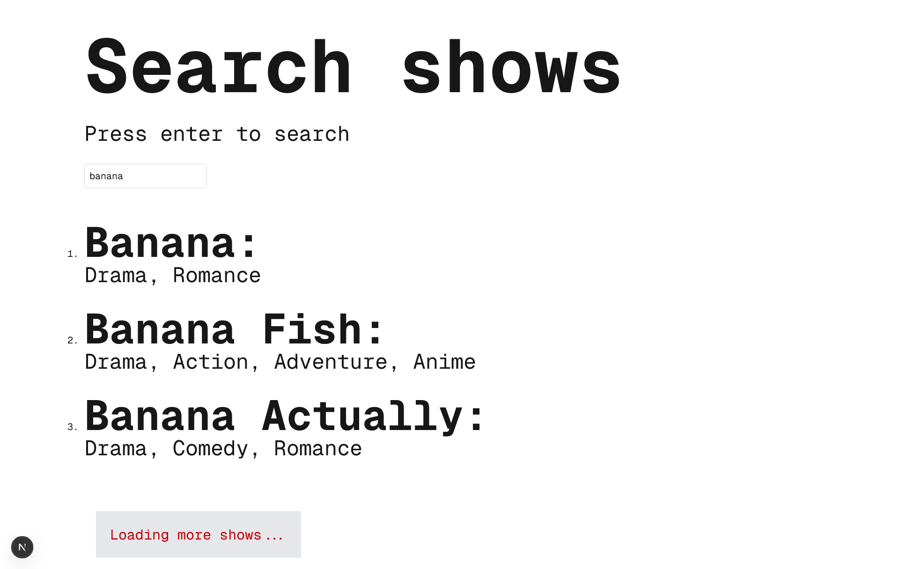

This is a [Next.js](https://nextjs.org) project bootstrapped with [`create-next-app`](https://nextjs.org/docs/pages/api-reference/create-next-app).

## Getting Started

First, run the development server:

```bash
npm run dev
```

- UI: [http://localhost:3000](http://localhost:3000)

- API: [http://localhost:3000/api/search/shows?term=banana&size=10&page=1](http://localhost:3000/api/search/shows?term=banana&size=100&page=1)
  - term = the search term
  - page = the page number of the resultset (defaults to 1)
  - size = the page size / results to include in the response from this api (defaults to 10)

## What it looks like




## Limitations

- The tvmaze API does not seem to support paging https://www.tvmaze.com/api#show-search.
- The tvmaze API seems to be limited to 10 results only. I tried various search terms and none gave more than 10 results. This suggests there may be paging but it's not documented. I tried params that could page the results but had no effect, though I likely missed the real syntax because I was guessing.
  - Tried these searches:
    - https://api.tvmaze.com/search/shows?q=banana
    - https://api.tvmaze.com/search/shows?q=the
    - https://api.tvmaze.com/search/shows?q=and
    - https://api.tvmaze.com/search/shows?q=a
  - Therefore I changed the page size to 3 so you can see the infinite scroll

## Decisions

- Using **nextjs** because it's really quick and easy to spin up a backend and frontend layer, and routing comes out-the-box
- Using **Axios** because it's an easy to use library
- Implemented caching with **axios-cache-interceptor** because it plugs in nicely with axios, and persists caching of different requests. **fetch** only seems to cache the last request, so when the search term changes, the next request is not cached even if the term was searched recently
- Used comically large fonts, and split the name and genres on 2 lines so that you can see the infinite scrolling. Without this everything loads before you get a change to scroll because everything is in view
- Added an arbitrary wait so you can see the loading state in the UI. Without it everything loads too fast to see it
- Used hooks to create reusable units, making the homepage easier to use
- Used just an input box to trigger searching, so that I didn't have to reimplement the search interractions when looking to solve the bonus part of the challenge

## With more time I would have...

- API

  - Considered using Redis so the cache isn't in memory
  - Wrapped the TV Maze to abstract from the implementation. Currently the call and the types are in with my application logic. The service is very simple atm, so seemed prudent to wait to see how complex the logic may get

- UI
  - Split the homepage code into multiple components. Eg header, search, results
- Added unit testing. For timesake I decided to prioritise the fuctionality and the bonus part of the task. In my day-to-day work I almost always add or extend unit tests
- Added a CI pipeline to verify the quality of the code and whether it builds
- The types are in a types folder. I generally prefer to have the types close to the application logic, but there are so few files due to there only being one thing implemented, it seemed clearer to put the types in one folder. I could have created more nested folder structure as if this api was one of many, but thought it would look more confusing.
